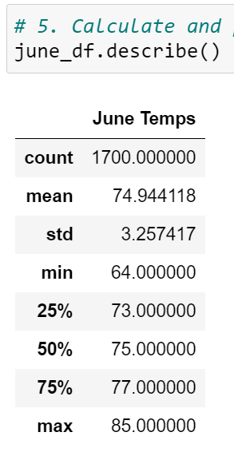
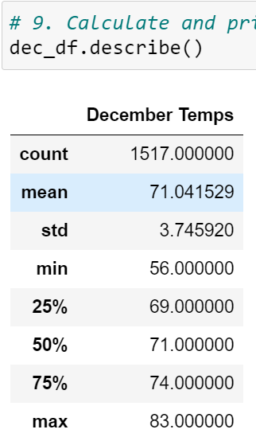
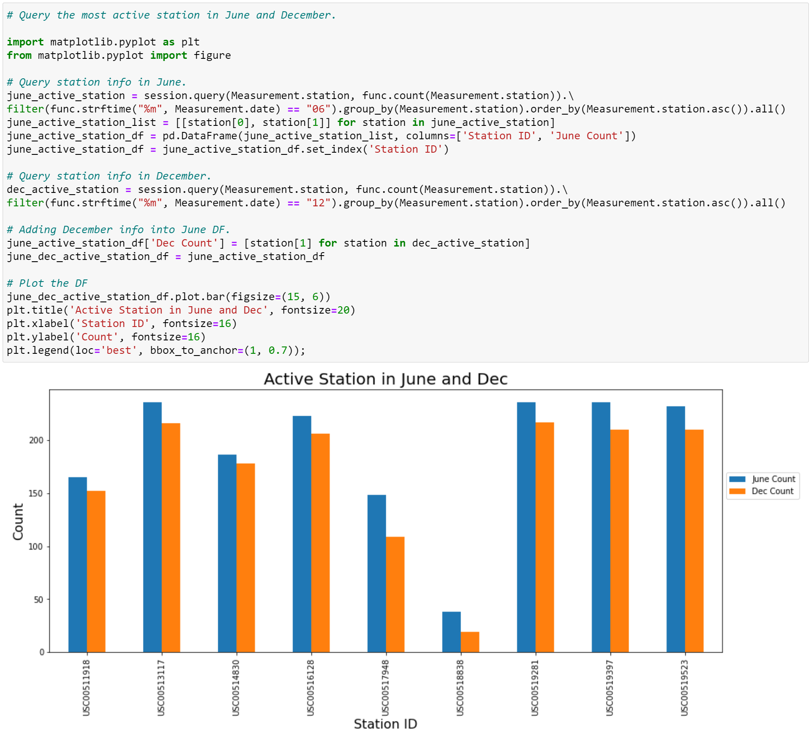
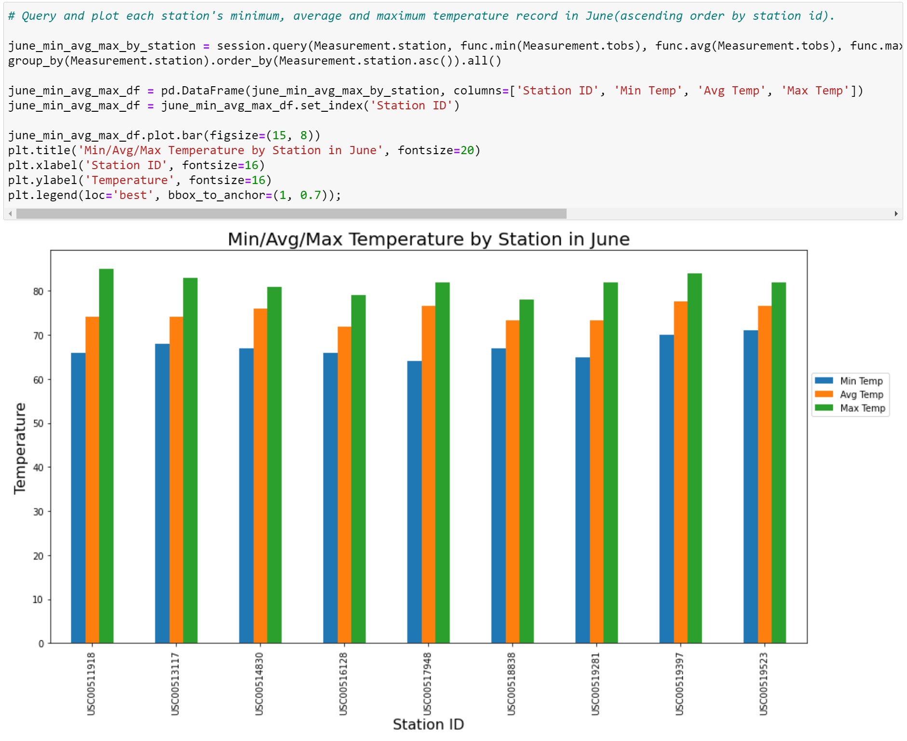
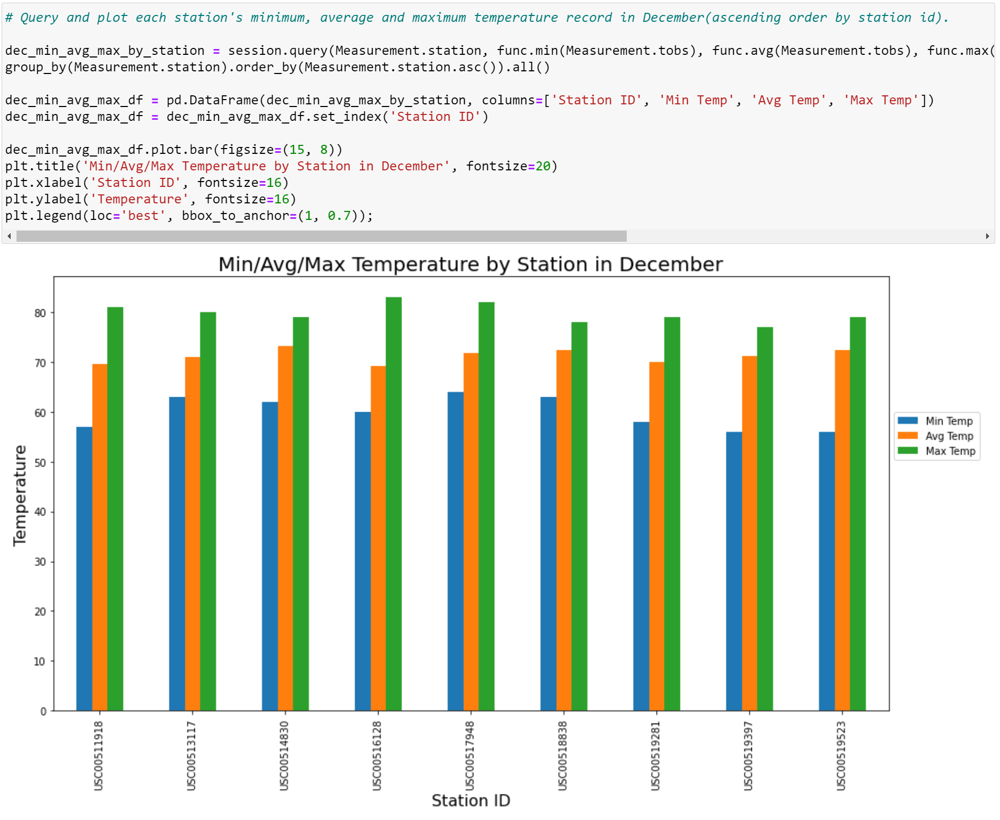

# surfs_up

## Overview of the Analysis
The purpose of this project is to provide temperature data specifically for the months of June and December in Oahu, in order to determine if the surf and ice cream shop business is sustainable year-round.

## Results
The 3 key differences in weather between June and December are as follows:
- Oahu has higher mean temperature in June than in December.
- Oahu has higher minimum temperature in June than in December.
- Oahu has higher maximum temperature in June than in December.

June DataFrame:

December DataFrame:

## Summary
To summarize, although the temperature in Oahu is higher in June than in December, the temperature is not varying too much such that the surf and ice cream shop business is sustainable year-round.

Additional queries that could be performed to gather more weather data for June and December are as follows:

- The Active Station chart shows how many temperature information those stations record in June and December.

- The Min/Avg/Max Temperature by Station charts shows the temperature details by each station in June and December.

June: 

December:

